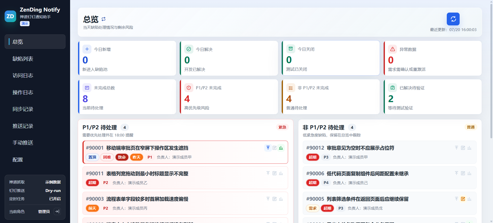
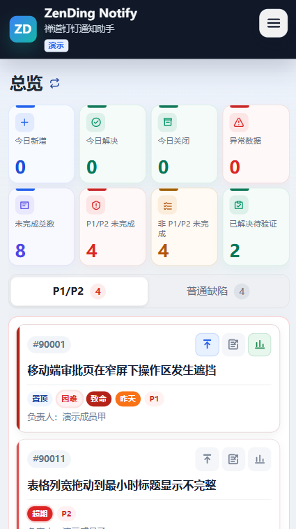
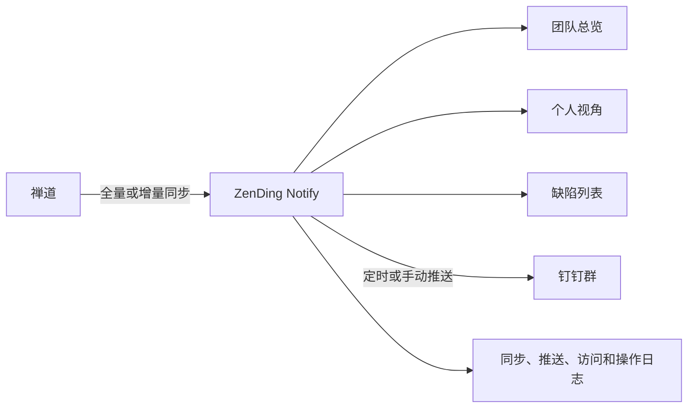

# ZenDing Notify

面向研发团队的禅道缺陷看板与钉钉提醒服务。它会按配置人员同步禅道缺陷，提供团队总览和个人视角，并将 P1/P2 风险或超期缺陷推送到钉钉群。

项目使用原生 Node.js、HTML、CSS 和 JavaScript，不依赖数据库或前端构建工具。运行数据保存在本地 JSON 文件中，适合内网、小团队和单机部署。

## 在线演示

- 演示地址：<https://lss.is-a.dev/ZenDingNotify/>

演示版使用脱敏模拟数据，所有操作仅保存在当前浏览器的 `localStorage` 中，不会连接真实禅道、发送钉钉消息或保存真实凭据。需要恢复初始状态时，清除该站点的浏览器数据后重新打开即可。

## 界面预览

以下截图使用脱敏演示数据，展示管理员进入系统后看到的首页总览。

### PC 端首页

PC 端采用固定侧边导航和宽屏信息布局。顶部集中展示缺陷处理指标，下方将 P1/P2 与普通待处理缺陷分栏呈现，适合在日常工作中快速扫描风险、对比数量并直接执行缺陷操作。



### 移动端首页

移动端重新组织了信息层级：核心指标压缩为两行网格，待处理缺陷通过页签切换，并将常用操作放在卡片内便于触控。页面保留与 PC 端一致的数据口径，同时减少横向滚动和无效留白。

<p align="center">
  
</p>

## 一眼看懂

| 能力 | 说明 |
| --- | --- |
| 缺陷总览 | 今日新增、解决、关闭、转入、转出，未完成、P1/P2、待验证和异常数据 |
| 个人视角 | 管理员或访客可切换到指定负责人，只查看与该人员相关的数据 |
| 缺陷操作 | 待办缺陷支持置顶、需求标记和修复难度标记，结果持久化保存 |
| 新缺陷通知 | 个人视角同步到新缺陷时，显示页面通知卡片并尝试发送浏览器通知 |
| 钉钉推送 | 支持 P1/P2 风险提醒、超期缺陷单、Dry-run、加签和群内 @所有人 |
| 定时同步 | 首次全量、日常增量；新增负责人时仅为新增人员补充全量详情 |
| 运行审计 | 推送记录、同步记录、页面访问日志和操作日志；访问日志包含 IP、会话状态及可识别的终端信息 |
| 移动端 | 总览、缺陷列表、日志、手动推送和配置页面均提供移动端交互 |



## 文档导航

- [界面预览](#界面预览)
- [快速开始](#快速开始)
- [技术栈与设计原则](#技术栈与设计原则)
- [首次初始化](#首次初始化)
- [日常使用](#日常使用)
- [同步策略](#同步策略)
- [生产部署](#生产部署)
- [备份和升级](#备份和升级)
- [常用 API](#常用-api)
- [常见问题](#常见问题)

## 技术栈与设计原则

ZenDing Notify 刻意保持技术栈纯粹：不引入重量级框架，不依赖数据库，也不需要前端编译。仓库代码就是最终运行代码，便于在内网环境中阅读、审计、修改和部署。

| 层级 | 技术 | 说明 |
| --- | --- | --- |
| 服务端 | 原生 Node.js ES Modules | 使用 `node:http`、`fetch`、`fs/promises`、`crypto` 等内置 API |
| 前端 | 原生 HTML、CSS、JavaScript | 无 React、Vue、Angular，无组件运行时 |
| HTTP API | 原生路由与 JSON 响应 | 不依赖 Express、Koa、NestJS 等 Web 框架 |
| 数据持久化 | 本地 JSON 文件 | `config.json` 保存配置，`store.json` 保存业务快照和日志 |
| 定时任务 | Node.js 进程内调度 | 无需 Redis、消息队列或独立调度服务 |
| 页面构建 | 无构建步骤 | 无 Webpack、Vite、Babel，浏览器直接加载 `public/` 文件 |
| 运行依赖 | 零第三方 npm 依赖 | 当前 `package.json` 不包含 `dependencies` 或 `devDependencies` |
| 生产运行 | systemd + 可选反向代理 | 推荐使用 Nginx 或 Caddy 提供域名、HTTPS 和访问控制 |

### 为什么采用原生实现

- **部署简单**：准备 Node.js 后即可运行，不需要安装数据库、缓存或构建工具链。
- **升级可控**：没有庞大的依赖树，减少依赖冲突、供应链风险和版本升级成本。
- **便于审计**：认证、同步、推送、日志和页面交互都能直接在仓库代码中定位。
- **适合内网**：在无法稳定访问公共 npm 仓库的环境中，也能完成安装和启动。
- **资源占用低**：单个 Node.js 进程即可提供静态页面、API、定时同步和推送服务。

### 无数据库模式

项目不要求 MySQL、PostgreSQL、MongoDB 或 Redis。运行状态集中保存在：

```text
data/config.json
data/store.json
```

这种模式适合单实例、小团队和中低数据量场景，备份与迁移只需复制两个文件。它也意味着：

- 同一套运行数据不应被多个服务实例同时写入。
- 不适合直接做多实例负载均衡或高并发写入。
- `data/` 必须放在持久磁盘上，并纳入定期备份。
- 容器化部署时必须把 `data/` 挂载到宿主机或持久卷。

如果未来需要多实例、高可用或大规模日志检索，应先将持久化层迁移到数据库，再引入分布式锁或任务队列；当前架构优先保证单机部署的透明、稳定和低维护成本。

## 访问角色

| 入口 | 权限 | 是否需要密码 |
| --- | --- | --- |
| `/` | 管理后台全部功能 | 管理员密码 |
| `/guest` | 团队总览和缺陷列表 | 否，可匿名访问 |
| `/guest/<人员英文账号>` | 当前人员的总览、缺陷列表和本人待办操作 | 是，首次访问设置密码 |
| `#/<人员英文账号>/overview` | 管理员切换到某个人员视角 | 仍保持管理员身份 |

个人地址不要手工猜测。管理员先在“配置 > 缺陷规则”选择负责人，再通过总览的负责人姓名或视角切换菜单进入对应地址。未配置人员会提示“人员不存在”。

## 运行要求

- Node.js 18 或更高版本，生产环境推荐 Node.js 22 LTS
- 能访问目标禅道站点的网络
- 可选：钉钉自定义机器人 Webhook 和加签 Secret
- 可选：Nginx、Caddy 或其他反向代理，用于域名和 HTTPS

项目当前没有第三方运行时依赖，因此克隆后即可启动。

## 快速开始

```bash
git clone https://github.com/liushuisheng/ZenDingNotify.git
cd ZenDingNotify
npm start
```

默认监听 `8787` 端口：

```text
http://localhost:8787
```

局域网直接访问时必须带端口：

```text
http://<服务器IP>:8787
http://<服务器IP>:8787/guest
```

只有配置了监听 80/443 端口的反向代理后，才能省略 `:8787`。

## 首次初始化

首次启动会自动创建以下文件：

```text
data/config.json  # 禅道、钉钉、规则、定时任务和管理员密码
data/store.json   # 缺陷快照、标记、访客密码和各类日志
```

这两个文件包含密码、Cookie、Webhook 和运行数据，已被 `.gitignore` 排除，禁止提交到 Git。

### 1. 获取初始管理员密码

首次启动会生成随机管理员密码并写入 `data/config.json` 的 `auth.adminToken`。

Linux/macOS：

```bash
node -e "console.log(JSON.parse(require('fs').readFileSync('data/config.json','utf8')).auth.adminToken)"
```

Windows PowerShell：

```powershell
(Get-Content .\data\config.json -Raw | ConvertFrom-Json).auth.adminToken
```

使用该密码登录 `/`。进入“配置 > 后台访问”后，建议立即换成便于管理的强密码并保存。

### 2. 配置禅道

在“配置 > 禅道连接”依次填写：

1. 禅道地址，例如 `https://zentao.example.com/zentao`。
2. 登录账号和密码。
3. 当前已登录禅道会话的 Cookie。需要读取缺陷详情和操作历史时建议填写。
4. 产品 ID 列表和项目/迭代 ID。
5. 开启“启用真实禅道抓取”。

未开启真实抓取时，系统使用示例缺陷，便于先确认界面和推送流程。

### 3. 配置缺陷口径和负责人

在“配置 > 缺陷规则”设置：

- 缺陷状态：参与总览和同步的状态。
- 全部优先级：允许进入数据范围的优先级。
- 紧急优先级：P1/P2 风险提醒采用的优先级。
- 只看这些负责人：首页统计、个人地址和增量同步都以这里的人员为准。

没有配置负责人时，不会回退到前端内置人员名单。保存配置后会自动同步一次禅道数据。

### 4. 配置钉钉机器人

1. 在钉钉群中创建自定义机器人并复制 Webhook。
2. 如果机器人开启加签，填写 Secret。
3. 首次建议保持“Dry-run 模式”开启，通过“手动推送”和“推送记录”检查内容。
4. 验证无误后关闭 Dry-run，消息才会真实发送。
5. 需要通知全群时开启“群内 @所有人”。当前版本不提供逐个人手机号 @ 配置。

### 5. 配置定时任务

- 自动抓取间隔默认 5 分钟，最小 1 分钟。
- P1/P2 风险提醒默认 `18:00`，可配置多个时间。
- 总开关关闭后，自动抓取和定时推送都不会执行。
- 定时任务使用服务器本地时间，请确认操作系统时区正确。

### 6. 初始化个人访客密码

个人访客首次打开 `/guest/<人员英文账号>` 时，输入的密码会被保存为该人员的初始密码。之后必须使用同一密码登录。

管理员可在“配置 > 后台访问 > 访客密码重置”中重置某个人员密码。重置后，该人员下次访问时重新设置初始密码。

## 日常使用

### 管理员

- 在总览查看团队数据和负责人对比。
- 点击负责人姓名或“当前视角”后的切换图标进入个人视角。
- 在缺陷列表按优先级、状态、负责人、创建时间和排序方式筛选。
- 在待办卡片上置顶、标记需求或设置修复难度。
- 在手动推送页面预览并发送 P1/P2 或超期缺陷消息。
- 在日志页面排查访问、操作、同步和钉钉推送结果。

### 团队访客

- `/guest` 只显示总览和缺陷列表，不提供管理菜单。
- 匿名访问会记录访问 IP、时间和会话状态。
- 已登录个人访客再访问 `/guest` 时，访问对象会记录为该登录人员。

### 个人访客

- 只显示当前人员相关数据，并隐藏负责人筛选。
- 只能操作属于自己的待办缺陷。
- 同步后发现新缺陷时，右上角显示通知卡片；允许浏览器通知后还会发送系统通知。
- 浏览器通知通常要求 HTTPS；`localhost` 是例外，普通局域网 HTTP 地址可能无法获取通知权限。

## 同步策略

系统根据负责人配置自动选择同步模式：

| 模式 | 触发条件 | 行为 |
| --- | --- | --- |
| 全量 | 首次同步、缺少同步水位或未配置负责人 | 获取当前范围并补充全部必要详情 |
| 增量 | 负责人没有变化 | 重点更新上次成功同步后发生变化的数据 |
| 混合 | 新增了负责人 | 原负责人继续增量，仅为新增负责人补充全量详情 |

同步过程中或同步失败时，页面会保留上一次成功同步的数据。同步时间、耗时、模式、结果和数据变化可在“同步记录”查看。

## 本地前端连接远程后端

复制环境变量示例：

```bash
cp .env.example .env
```

Windows PowerShell：

```powershell
Copy-Item .env.example .env
```

填写远程服务地址，不要以 `/` 结尾：

```dotenv
API_BASE_URL=https://notify.example.com
PUBLIC_BASE_URL=https://notify.example.com
```

然后仍然访问 `http://localhost:8787`。本地 Node 服务会代理所有 `/api/*` 请求，登录 Cookie 保留在本地域名下，不需要额外配置 CORS。

代理模式不会启动本地定时任务，以免与远程服务重复同步或推送。修改 `.env` 后必须重启本地服务。

可用环境变量：

| 变量 | 默认值 | 说明 |
| --- | --- | --- |
| `PORT` | `8787` | HTTP 监听端口 |
| `API_BASE_URL` | 空 | 远程 API 代理地址；生产服务通常应留空 |
| `PUBLIC_BASE_URL` | 自动识别 | 推送消息中“缺陷总览”的公开访问地址；定时推送环境建议显式配置 |
| `LOG_LEVEL` | `silent` | `silent`、`error`、`info` 或 `debug` |

## 调试日志

```bash
# API 请求、耗时和错误
npm start -- --log=info

# 额外记录禅道和钉钉外部请求；敏感 URL 参数会打码
npm start -- --log=debug

# debug 简写
npm start -- --debug
```

修改 `src/server.js`、环境变量或服务配置后需要重启 Node 服务。只修改 `public/` 下静态前端文件时，开发环境通常刷新浏览器即可；生产缓存场景可能还需要刷新代理缓存。

## 生产部署

### 使用 systemd 运行

将项目放在 `/opt/ZenDingNotify`，创建专用用户，并确保该用户可读写 `data/`。

示例 `/etc/systemd/system/zendingnotify.service`：

```ini
[Unit]
Description=ZenDing Notify
After=network-online.target
Wants=network-online.target

[Service]
Type=simple
User=zendingnotify
Group=zendingnotify
WorkingDirectory=/opt/ZenDingNotify
Environment=NODE_ENV=production
Environment=PORT=8787
ExecStart=/usr/bin/node src/server.js
Restart=always
RestartSec=3

[Install]
WantedBy=multi-user.target
```

启用服务：

```bash
sudo systemctl daemon-reload
sudo systemctl enable --now zendingnotify
sudo systemctl status zendingnotify
```

请通过 `which node` 确认 `ExecStart` 中的 Node.js 路径。

### 使用 Nginx 和 HTTPS

```nginx
server {
    listen 80;
    server_name notify.example.com;

    location / {
        proxy_pass http://127.0.0.1:8787;
        proxy_http_version 1.1;
        proxy_set_header Host $host;
        proxy_set_header X-Real-IP $remote_addr;
        proxy_set_header X-Forwarded-For $proxy_add_x_forwarded_for;
        proxy_set_header X-Forwarded-Proto $scheme;
    }
}
```

生产环境建议为域名配置 TLS，并将 HTTP 强制跳转到 HTTPS。不要直接把 `data/` 目录暴露为静态资源。

### GitHub Actions 自动部署

仓库的 [`.github/workflows/deploy.yml`](.github/workflows/deploy.yml) 会在推送 `main` 后：

1. 使用 Node.js 22 检查服务端和浏览器脚本语法。
2. 使用 GitHub Secret `TENCENT_SSH_KEY` 建立 SSH 连接。
3. 调用远程服务器的受限命令 `deploy <commit-sha>`。
4. 远程脚本保存 `data/config.json` 和 `data/store.json`，更新到指定提交并重启服务。
5. 健康检查失败时自动回滚到上一个提交。

当前工作流中的服务器地址、SSH 指纹、部署用户、目录和服务名是环境专用配置。部署到其他服务器前，需要同步修改：

- `.github/workflows/deploy.yml`
- `scripts/deploy-server.sh`
- `scripts/deploy-ssh-command.sh`
- GitHub Environment `production` 和 Secret `TENCENT_SSH_KEY`

## 备份和升级

必须备份以下运行文件：

```text
data/config.json
data/store.json
```

手动升级建议流程：

```bash
sudo systemctl stop zendingnotify
cp data/config.json /安全备份目录/config.json
cp data/store.json /安全备份目录/store.json
git pull --ff-only origin main
npm run check
node --check public/app.js
sudo systemctl start zendingnotify
```

不要使用会删除 `data/` 的部署命令。恢复备份时应先停止服务，恢复文件后再启动，避免运行中的进程覆盖数据。

## 常用 API

管理员接口使用登录 Cookie，也支持请求头 `x-admin-token`。

| 方法 | 路径 | 说明 | 权限 |
| --- | --- | --- | --- |
| `GET` | `/api/overview` | 总览数据，可用 `owner` 查询个人范围 | 团队公开；个人范围需对应访客登录或管理员 |
| `GET` | `/api/defects` | 缺陷快照，可用 `owner` 查询个人范围 | 同上 |
| `GET` | `/api/config-status` | 抓取、推送、定时任务和同步状态 | 公开 |
| `GET` | `/api/push-logs` | 推送记录 | 管理员 |
| `GET` | `/api/sync-logs` | 最近 7 天同步记录 | 管理员 |
| `GET` | `/api/access-logs` | 最近 7 天访问日志 | 管理员 |
| `GET` | `/api/operation-logs` | 最近 7 天操作日志 | 管理员 |
| `POST` | `/api/actions/fetch` | 手动同步禅道 | 管理员 |
| `POST` | `/api/actions/push/p1p2` | 手动执行 P1/P2 风险提醒 | 管理员 |
| `POST` | `/api/actions/push/overdue` | 手动执行超期缺陷推送 | 管理员 |
| `GET/PUT` | `/api/config` | 读取或保存配置 | 管理员 |

`/api/actions/push/rule` 和 `/api/actions/push/yesterday` 已停用，不应继续调用。

## 常见问题

### 打开 `http://服务器IP/guest` 返回 404

直接运行 Node 服务时端口是 `8787`，应访问 `http://服务器IP:8787/guest`。只有 Nginx 等反向代理监听 80/443 时才能省略端口。

### 管理后台提示需要登录，但不知道密码

从 `data/config.json` 读取 `auth.adminToken`。如果文件中为空，重启服务会自动生成并保存随机值。

### 个人访客提示“人员不存在”

确认该人员已经加入“配置 > 缺陷规则 > 只看这些负责人”，然后从页面上的负责人链接或视角切换菜单进入，避免手工拼写个人地址。

### 忘记个人访客密码

管理员进入“配置 > 后台访问”，选择对应人员并点击“重置密码”。该人员下次访问个人页时重新设置密码。

### 首页没有数据，但 `/guest` 有数据

先确认管理员已经登录。随后检查浏览器 Network 中 `/api/overview` 是否返回 `401` 或 `500`，并查看服务日志。同步失败时页面会保留上一次缓存；完全没有历史缓存时才会显示无数据。

### 同步后数据仍然没有更新

1. 检查“同步记录”的结果和错误信息。
2. 确认负责人、状态、优先级、产品 ID 和项目 ID 配置正确。
3. 确认禅道 Cookie 未过期，并且服务所在机器能访问禅道。
4. 修改过 `src/server.js` 后必须重启服务。

### `/api/sync-logs` 返回 404

通常表示运行中的还是旧版服务。确认代码已更新，然后重启 Node 或 systemd 服务：

```bash
sudo systemctl restart zendingnotify
```

### 同步速度较慢

首次同步和新增负责人会读取更多缺陷详情，耗时通常高于日常增量同步。负责人不变后会自动进入增量模式。可在“同步记录”查看本次是全量、增量还是混合模式。

### 定时提醒没有执行

检查以下项目：

1. Node 服务在目标时间持续运行。
2. 定时任务总开关和 P1/P2 规则开关都已开启。
3. 服务器时区与期望时区一致。
4. `API_BASE_URL` 为空；代理模式会关闭本地定时任务。
5. 同步记录和推送记录中是否存在失败信息。

### 钉钉记录成功但群里没有消息

如果结果显示 `Dry-run 成功`，说明当前只生成内容、不真实发送。关闭 Dry-run 后重试，并检查 Webhook、加签 Secret 和机器人安全设置。

### 已开启“群内 @所有人”，记录里仍显示 `-`

保存配置后重新执行一次推送。历史记录不会随配置变化。真实发送时，推送记录的 @ 列应显示“所有人”。

### 浏览器没有新缺陷通知

- 只有个人访客页和管理员个人视角会发送新缺陷通知。
- 需要允许浏览器通知权限。
- 除 `localhost` 外，浏览器通常要求 HTTPS。
- 通知只针对同步后新出现且属于当前人员的缺陷，不会把已有快照全部当作新缺陷。

### 如何查看更详细的错误

```bash
npm start -- --log=debug
```

systemd 环境可查看：

```bash
journalctl -u zendingnotify -f
```

## 项目结构

```text
ZenDingNotify/
├─ .github/workflows/   # GitHub Actions 检查与部署
├─ data/                # 本地配置和运行数据，不提交 Git
├─ public/              # HTML、CSS、浏览器 JavaScript 和图标
├─ scripts/             # 生产服务器部署与受限 SSH 命令
├─ src/server.js        # HTTP 服务、禅道同步、钉钉推送、认证和定时任务
├─ .env.example         # 本地 API 代理配置示例
└─ package.json
```

## 安全建议

- 管理员密码、禅道密码、Cookie、钉钉 Webhook 和 Secret 都属于敏感信息。
- 限制 `data/config.json` 和 `data/store.json` 的文件权限，仅允许运行用户读取。
- 生产环境使用 HTTPS，并通过防火墙限制 `8787` 端口只允许本机反向代理访问。
- 不要将 `.env`、`data/`、日志截图或真实 Webhook 提交到公开仓库。
- `/guest` 是公开团队视图；如果数据不适合匿名访问，应在反向代理层增加访问控制，或仅允许内网访问。
